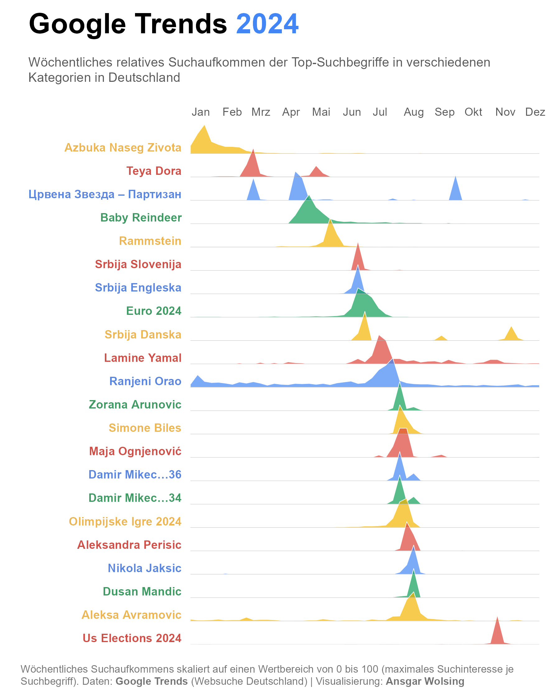

# Google Trends 2023

Create a chart with the weekly flow of Google Trends (Search) for a country or region.

The chart shows the weekly relative search interest of the top search terms across various categories in Germany. A value of 100 indicates that a search term was searched the most during that week within the year—always relative to the specific term. (Over the course of the year, each search term reaches a value of 100 at least once; however, the absolute search volumes of two terms can differ.)

Manually download the weekly data for Google Trends for specific keywords from https://trends.google.com/trends/yis/2023/DE/. You can switch to other countries on the page. You need to download one file per search term.

The code offers a light and a dark themed chart.
